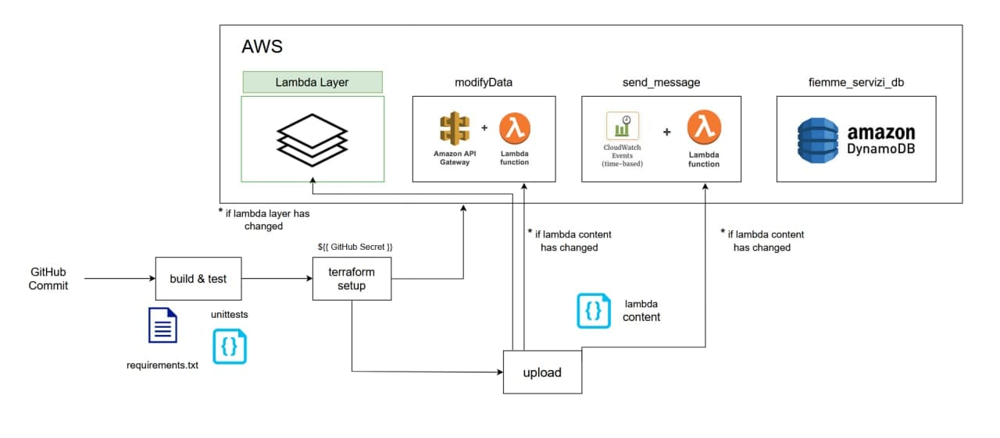

# System Engineering project

The goal of this project was to set up a cloud environment trough
a "infrastructure as code" framework. We also added a pipeline
using github actions in order for every new change the code on the cloud
to be updated and always at the latest version.

## Authors

- [Simon Gschnell](https://github.com/SimonGschnell)
- [Sebastian Cavada](https://github.com/Sebo-the-tramp)

## Appendix

We used the following services:

- github actions
- terraform
- aws
  - lambda functions
  - dynamo db
  - api gateway
- serverless (to dive deep for serverless infrastructure as a code)

## Badges

## Documentation

### Description of the problem

The service is basically a reminder service for people leaving in val di Fiemme
where each day the garbage is picked up at each home. The problem is that
everyday there is a different type of garbage to be collected. People have
to put the garbage bin out in the evening so very early the next morning
it can be picked up. So the bot will let all people know when to put
out when.

### The infrastructure

We used a microservice approach, and we used lambda functions for it,
we had to divide the code into its very small parts so to be executed
only the needed part. We also used dynamoDB which provides us with 25Gb
of free storage in order to store the user preferences.
The lambda functions used also a shared library that we uploaded all together
so to make the most out of code reusability.
The code that could be executed could be either:

- Update of the preferences
- Send the reminder to the users

(Each of them had its very own trigger as well)

#### Update

The update is triggered by the user action, which is collected by telegram
and sent to a webhook at an API gateway endpoint. Then the API will trigger
the function and update the state accordingly to the user input

#### Reminder

With Cloud Watch we also set up a cronjob that everyday at 8:00PM
will fire and trigger the message to be sent to all users accordingly
to the state they previously set.

### Diagram of the infrastructure

### The pipeline

The pipeline is triggered when a new commit or a merge request to the master branch is made. The pipelinesteps are divided into 3 phases:

- Build & test

The 'Build & test' phase is used to install all the required python libraries (using the requirements.txt file) and run the tests for the application.
- Terraform setup

The 'terraform setup' phase uses the github secrets to create:

lambda layer (libraries for both of the lambda functions)
2 lambda functions 
dynamoDB database

- Upload

The 'Upload' phase checks if changes were made to the content of any lambda function. If changes were detected, the new lambda content is rezipped and the terraform plan will be modified.

### Diagram of the pipeline

## Difficulties that we had

For both of us, it was the first time we used pipelines in a devops environment so basically it was all a challenge for us.
One of the trickiest part for us was to be able to upload a zip file to AWS, which was basically the core of the project. We tried to make a trade off, and since the zip would be touched the least we decided to store it statically in order to speed up the process and make few computation manually. That was because the zip file system together with the artifacts function, didn't really work very good together, maybe for the different way of zip the files in the docker images.

The other hard part was to learn terraform, such a new and wide area, but in the end it was worth it, and also the online material wasn't very good, it was good enough, and better than other documentation.

## Migration to another cloud provider

The migration to other cloud based systems such as google's or microsoft azure is bounded by the different type of services that they have. For example we used lambda function massively, but they are not the same on other systems, just to start with the handling of libraries. So whenever we want to make a migration, an accurate acknowledgement has to be made in order to validate all the requirements and find the matching services of the new cloud environment.

In the following we will analyze how the system would have to change, with the serverless framework and microsoft azure. The serverless framework is supposed to simplify

### Serverless framework

### Microsoft azure environment

